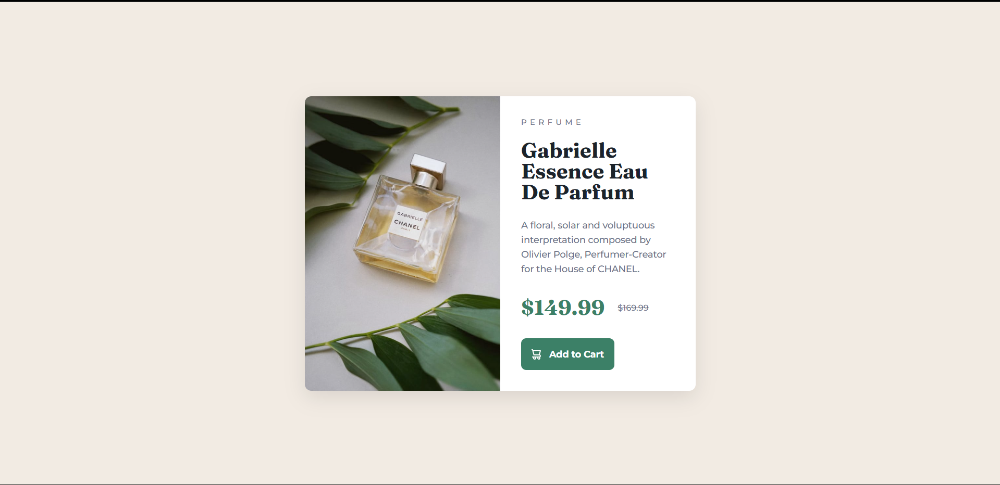
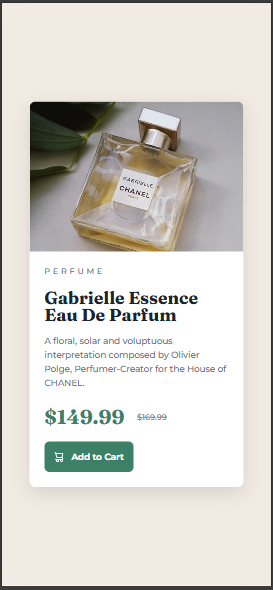

# Frontend Mentor - Product preview card component solution

This is a solution to the [Product preview card component challenge on Frontend Mentor](https://www.frontendmentor.io/challenges/product-preview-card-component-GO7UmttRfa). Frontend Mentor challenges help you improve your coding skills by building realistic projects. 

## Table of contents

- [Overview](#overview)
  - [The challenge](#the-challenge)
  - [Screenshot](#screenshot)
  - [Links](#links)
- [My process](#my-process)
  - [Built with](#built-with)
  - [What I learned](#what-i-learned)
  - [Continued development](#continued-development)
  - [Useful resources](#useful-resources)
- [Author](#author)

## Overview

### The challenge

Users should be able to:

- View the optimal layout depending on their device's screen size
- See hover and focus states for interactive elements

### Screenshot




### Links

- Solution URL: [GitHub Repository](https://github.com/Chandru37-ctrl/product-preview-card)
- Live Site URL: [Live Demo](https://chandru37-ctrl.github.io/Frontend_mentor_projects/product-preview-card)

## My process

### Built with

- Semantic HTML5 markup
- CSS custom properties
- Flexbox
- CSS Grid
- Mobile-first workflow
- Google Fonts (Montserrat & Fraunces)

### What I learned

This project helped me solidify my understanding of CSS Grid for creating responsive layouts without media query complexity. I particularly enjoyed working with the two-column to single-column transformation:

```css
.card {
    display: grid;
    grid-template-columns: 1fr 1fr;
}

@media (max-width: 640px) {
    .card {
        grid-template-columns: 1fr;
    }
}
```

I also practiced using CSS custom properties (variables) for maintaining consistent colors throughout the design:

```css
:root {
    --green-500: hsl(158, 36%, 37%);
    --green-700: hsl(158, 42%, 18%);
    --black: hsl(212, 21%, 14%);
}
```

Working with HSL color values was a great learning experience, as it made it easier to create hover states by adjusting lightness values.

### Continued development

In future projects, I want to focus on:

- Advanced CSS Grid techniques for more complex layouts
- CSS animations and transitions for enhanced user experience
- Accessibility improvements (ARIA labels, keyboard navigation)
- CSS architecture and organization (BEM methodology)
- Performance optimization for images and fonts

### Useful resources

- [CSS Grid Guide](https://css-tricks.com/snippets/css/complete-guide-grid/) - This comprehensive guide helped me understand CSS Grid properties and use cases.
- [MDN Web Docs - Flexbox](https://developer.mozilla.org/en-US/docs/Web/CSS/CSS_Flexible_Box_Layout/Basic_Concepts_of_Flexbox) - Great resource for understanding flexbox alignment and spacing.
- [Google Fonts](https://fonts.google.com/) - Used to integrate custom typography seamlessly.

## Author

- Frontend Mentor - [@Chandru37-ctrl](https://www.frontendmentor.io/profile/Chandru37-ctrl)
- GitHub - [@Chandru37-ctrl](https://github.com/Chandru37-ctrl)
- LinkedIn - [CHANDRU S M](https://www.linkedin.com/in/chandru-s-m-479246294/)

## Acknowledgments

Thanks to the Frontend Mentor community for providing feedback and inspiration. Special appreciation to the challenge creators for designing such practical and educational projects that help developers improve their skills.

---

## 🚀 Getting Started

To view this project locally:

1. Clone the repository
```bash
git clone https://github.com/yourusername/product-preview-card.git
```

2. Navigate to the project directory
```bash
cd product-preview-card
```

3. Open `index.html` in your browser
```bash
open index.html
```

Or simply double-click the `index.html` file.

## 📁 Project Structure

```
product-preview-card/
│
├── index.html          # Main HTML file
├── images/            # Product images
│   ├── image-product-desktop.jpg
│   └── image-product-mobile.jpg
├── screenshots/       # Screenshots for README
│   ├── desktop-view.png
│   └── mobile-view.png
├── README.md          # This file
```

## 🎨 Design Specifications

### Colors

- **Primary Green**: `hsl(158, 36%, 37%)`
- **Dark Green (hover)**: `hsl(158, 42%, 18%)`
- **Cream Background**: `hsl(30, 38%, 92%)`
- **Dark Blue**: `hsl(212, 21%, 14%)`
- **Grayish Blue**: `hsl(228, 12%, 48%)`
- **White**: `hsl(0, 0%, 100%)`

### Typography

- **Font Families**: 
  - Montserrat (500, 700)
  - Fraunces (700)
- **Body Font Size**: 14px

### Layout

- **Desktop**: 1440px
- **Mobile**: 375px

## 📝 License

This project is open source and available under the [MIT License](LICENSE).

---

**Happy Coding!** 💻✨
